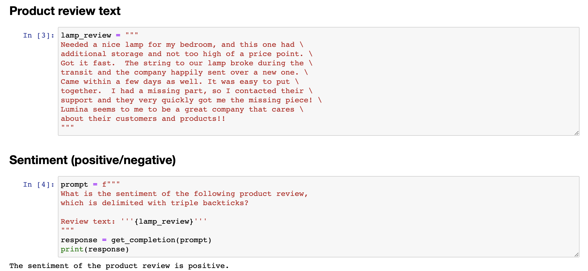
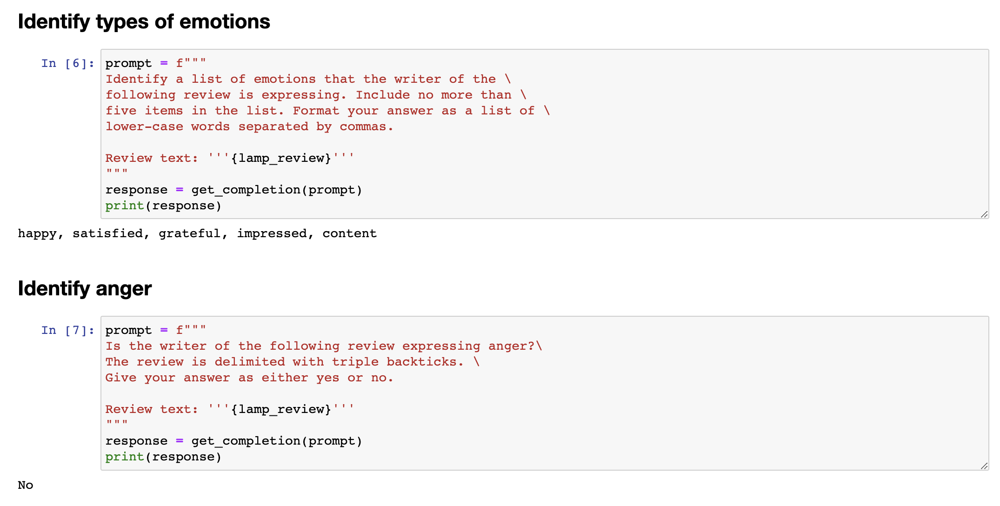
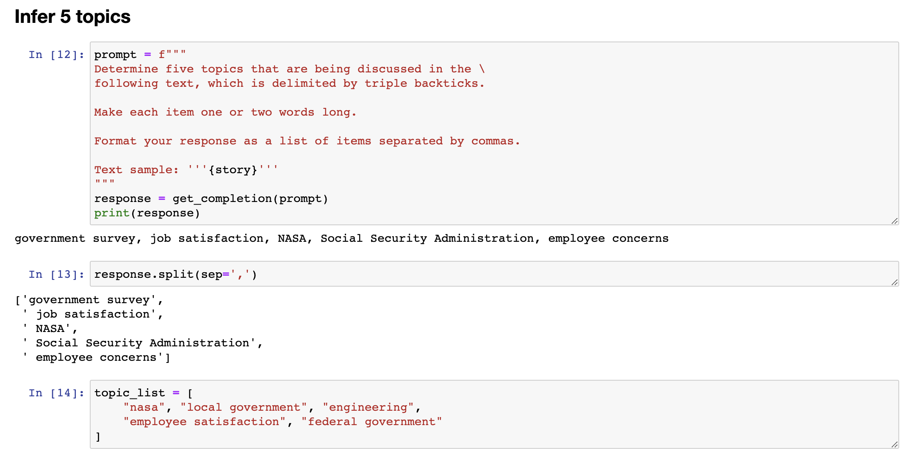

#  5.推理类应用

---

```{toctree}
:maxdepth: 2
:caption: 目录
```

```
chatgpt prompt：请帮我用中文进行全文翻译下面这段英文，并结构化输出为中文文本段落
```

```
This next video is on inferring. I like to think of these tasks where the model takes a text as input and performs some kind of analysis. So this could be extracting labels, extracting names, kind of understanding the sentiment of a text, that kind of thing. So if you want to extract a sentiment, positive or negative, with a piece of text, in the traditional machine learning workflow, you'd have to collect the label data set, train the model, figure out how to deploy the model somewhere in the cloud and make inferences. And that can work pretty well, but it was just a lot of work to go through that process. And also for every task, such as sentiment versus extracting names versus something else, you have to train and deploy a separate model. 
```

下一个视频是关于推断的。我喜欢把这些任务看作是模型接受文本作为输入并进行某种分析的任务。因此，这可能涉及提取标签、提取名称、理解文本的情感等等。如果你想要从一段文本中提取情感，无论是积极的还是消极的，在传统的机器学习工作流程中，你需要收集标签数据集、训练模型、找出如何在云端部署模型并进行推断。这样做可能效果不错，但需要完成很多繁琐的工作。而且对于每个任务，如情感分析、提取名称或其他任务，你都需要训练并部署单独的模型。

```
One of the really nice things about a large language model is that for many tasks like these, you can just write a prompt and have it start generating results pretty much right away. And that gives tremendous speed in terms of application development. And you can also just use one model, one API, to do many different tasks rather than needing to figure out how to train and deploy a lot of different models. And so with that, let's jump into the code to see how you can take advantage of this. So here's a usual starter code. I'll just run that.
```

大语言模型的一个非常好的特点是，对于许多这样的任务，你只需要编写提示即可开始生成结果。这极大地提高了应用开发的速度。而且你只需要使用一个模型、一个API来完成许多不同的任务，而不需要找出如何训练和部署许多不同的模型。因此，让我们深入了解代码，看看你如何利用它。这里是一个通常的入门代码。我将直接运行它。


```
 And the most important example I'm going to use is a review for a lamp. So need a nice lamp for the bedroom, and this one additional storage, and so on. So let me write a prompt to classify the sentiment of this. 
```

---

## 5.1 产品评价文本情感分类

我要使用的最重要的示例是一个台灯的评论。因此，我要编写一个提示来分类这个评论的情感。

```
If you wanted to give a more concise response to make it easier for post-processing, I can take this prompt and add another instruction to give you answers in a single word, either positive or negative. So it just prints out positive like this, which makes it easier for a piece of text to take this output and process it and do something with it. Let's look at another prompt, again still using the lamp review. Here, I have it identify a list of emotions that the writer of the following review is expressing, including no more than five items in this list. So, large language models are pretty good at extracting specific things out of a piece of text. In this case, we're expressing the emotions. And this could be useful for understanding how your customers think about a particular product. 
```

如果我想让系统告诉我，你知道的，这个评论的情感是什么，我可以编写以下产品评论的情感是什么，在常规的分隔符和评论文本等信息后运行它。然后让我们运行一下。它显示该产品评论的情感是积极的，这似乎是非常正确的。这个台灯并不完美，但这位顾客似乎很满意。看起来是一家关心顾客和产品的好公司。



```
For a lot of customer support organizations, it's important to understand if a particular user is extremely upset. 
```

我认为积极情感似乎是正确的答案。现在这个代码将打印出整个句子，即该产品评论的情感是积极的。


## 5.2 文本情感分类

```
So you might have a different classification problem like this. Is the writer of the following review expressing anger? Because if someone is really angry, it might merit paying extra attention to have a customer review, to have customer support or customer success, reach out to figure what's going on and make things right for the customer. In this case, the customer is not angry. And notice that with supervised learning, if I had wanted to build all of these classifiers, there's no way I would have been able to do this with supervised learning in just a few minutes that you saw me do so in this video. I'd encourage you to pause this video and try changing some of these prompts. Maybe ask if the customer is expressing delight or ask if there are any missing parts and see if you can get a prompt to make different inferences about this lamp review. 
```

你可能有一个不同的分类问题，如下。这篇评论的作者是在表达愤怒吗？因为如果有人真的生气了，那可能就值得更加关注，建立客户评论、客户支持或成功的通道，以了解情况并为客户解决问题。在这种情况下，客户并没有生气。请注意，如果我想要用监督学习来构建所有这些分类器，那么在你看到我在视频中所做的几分钟内，我不可能通过监督学习完成这项任务。我鼓励你暂停这个视频，并尝试更改一些提示。也许询问客户是否表现出高兴，或者询问是否有任何遗漏的部分，看看你能否获得不同的提示，以对这个灯的评论进行不同的推断。



---

## 5.3 文本信息提取

```
Let me show some more things that you can do with this system, uhm, specifically extracting richer information from a customer review. So, information extraction is the part of NLP, of natural language processing, that relates to taking a piece of text and extracting certain things that you want to know from the text. So, in this prompt, I'm asking it, identify the following items, the item purchase, and the name of the company that made the item. Again, if you are trying to summarize many reviews from an online shopping e-commerce website, it might be useful for your large collection of reviews to figure out what were the items, who made the item, figure out positive and negative sentiment, to track trends about positive or negative sentiment for specific items or for specific manufacturers. And in this example, I'm going to ask it to format your response as a JSON object with item and brand as the keys. And so, if I do that, it says the item is a lamp, the brand is Luminar, and you can easily load this into the Python dictionary to then do additional processing on this output. In the examples we've gone through, you saw how to write a prompt to recognize the sentiment, figure out if someone is angry, and then also extract the item and the brand. 
```

让我展示一些你可以通过这个系统做的更多事情，特别是从客户评论中获取更丰富的信息。信息抽取是自然语言处理中的一部分，与从文本中提取你想要的信息有关。因此，在这个提示中，我要求它识别以下项目：购买的商品和制造商品的公司名称。如果你正在尝试总结来自在线购物电子商务网站的许多评论，可能需要你的大量评论来确定商品名称、制造商名称、正面和负面情感，以跟踪各个商品或制造商的积极或消极趋势。

在这个例子中，我将要求它将响应格式化为JSON对象，并将商品和品牌作为键。于是，如果我这样做，它说商品是台灯，品牌是Luminar，你可以轻松地将其加载到Python字典中，然后对此输出进行额外的处理。在我们通过的示例中，你看到如何编写提示来识别情感、确定是否有人生气，并提取商品和品牌。


```
One way to extract all of this information, would be to use 3 or 4 prompts and call getCompletion, you know, 3 times or 4 times, extract these different fields one at a time, but it turns out you can actually write a single prompt to extract all of this information at the same time. So, let's say, identify the fine items, extract sentiment, uhm, as a reviewer, expressing anger, item purchase, completely made it, uhm, and then here, I'm also going to tell it to format the anger value as a, as a boolean value, and let me run that, and this outputs a, uhm, JSON, where sentiment is positive, anger, and there are no quotes around false, because it asks it to just output it as a boolean value, uhm, it extracted the item as a lamp with additional storage instead of lamp, seems okay, but this way, you can extract multiple fields out of a piece of text with just a single prompt. And as usual, please feel free to pause the video and play with different variations on this yourself, or maybe even try typing in a totally different review to see if you can still extract these things accurately. Now, one of the cool applications I've seen of large language models is inferring topics. 
```

提取所有这些信息的一种方法是使用3或4个提示并调用getCompletion，你知道，3次或4次，一次提取这些不同的字段，但实际上你可以编写一个单一的提示来同时提取所有这些信息。因此，让我们说，识别细分项目，提取情感表达问题，作为评论者，表达愤怒，购买商品，完全制造它，然后在这里，我还要告诉它将愤怒值格式化为布尔值，让我运行一下，它输出一个JSON，其中情感为正面，愤怒值为false，周围没有引号，因为它要求将其输出为布尔值，它将商品提取为带有额外存储的台灯而不是普通的台灯，似乎还不错，但通过这种方式，你可以使用一个单一的提示从一段文本中提取多个字段。像往常一样，欢迎暂停视频并尝试自己进行不同变体的操作，或者甚至尝试键入完全不同的评论以查看是否仍然可以准确提取这些信息。


---

## 5.4 文本主体推断

```
Given a long piece of text, you know, what is this piece of text about? What are the topics? Here's a fictitious newspaper article about how government workers feel about the agency they work for. So, the recent survey conducted by government, you know, and so on, uh, results reviewed at NASA was a popular department with high satisfaction rating. 
```

现在，我看到的一个很棒的大语言模型应用是推断主题。给定一段长文本，你知道，这篇文章是关于什么的？有哪些主题？这是一篇关于政府工人对他们所在机构的感受的虚构报纸文章。回顾最近政府进行的调查结果，在NASA是一个受欢迎的部门，满意度很高。


```
I am a fan of NASA, I love the work they do, but this is a fictitious article. And so, given an article like this, we can ask it, with this prompt, determine five topics that are being discussed in the following text. Let's make each item one or two words long, format your response in a comma-separated list, and so if we run that, you know, we get out this article is about a government survey, it's about job satisfaction, it's about NASA, and so on. So, overall, I think pretty nice, um, extraction of a list of topics, and of course, you can also, you know, split it so you get, uh, pie to the list with the five topics that, uh, this article was about. And if you have a collection of articles and extract topics, you can then also use a large language model to help you index into different topics. So, let me use a slightly different topic list. 
```

我是NASA的粉丝，我喜欢他们的工作，但这是一篇虚构的文章。鉴于这篇文章，我们可以问问它，使用此提示，确定以下文本中正在讨论的五个主题。让我们把每个项目格式化为一个或两个单词，并以逗号分隔的列表形式回答，这样，如果我们运行它，您就知道，它论述了一项政府调查，它关于工作满意度，它涉及NASA，等等。因此，总的来说，我认为这是一个挺好的主题列表提取，当然，您也可以拆分它，以获取关于本文的五个主题列表。如果您有一组文章并提取主题，那么您还可以使用大型语言模型来帮助您索引到不同的主题。因此，让我使用稍微不同的主题列表。



## 5.5 文本信息分析

```
Let's say that, um, we're a news website or something, and, you know, these are the topics we track, NASA, local government, engineering, employee satisfaction, federal government. And let's say you want to figure out, given a news article, which of these topics are covered in that news article. So, here's a prompt that I can use. I'm going to say, determine whether each item in the following list of topics is a topic in the text below. Um, give your answer as a list of zero one for each topic. And so, great. So, this is the same story text as before. So, this thing's a story. It is about NASA. It's not about local governments, not about engineering. It is about employee satisfaction, and it is about federal government. So, with this, in machine learning, this is sometimes called a zero shot learning algorithm because we didn't give it any training data that was labeled. So, that's zero shot. And with 
```


假设我们是一个新闻网站或其他什么机构，你知道我们追踪的主题有NASA、地方政府、工程、员工满意度、联邦政府。现在你想找出在新闻文章中涉及到哪些主题。所以，我可以使用以下提示来确定。我将说，确定以下主题列表中的每个项目是否在下面的文本中。您的答案应该是每个主题的0或1的列表。这是之前的故事文本一样。所以这个故事是关于NASA的，不涉及地方政府或工程。它关于员工满意度以及涉及到联邦政府。因此，在机器学习中，这有时被称为zero-shot学习算法，因为我们没有给它任何已标记的训练数据。所以这是zero-shot。使用此技术，您可以快速并准确地确定新闻文章中所涉及的主题，然后更好地理解文章的主旨和内容。

