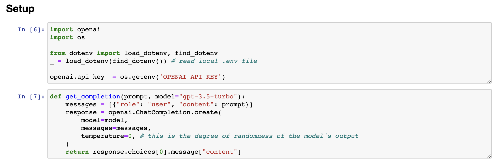
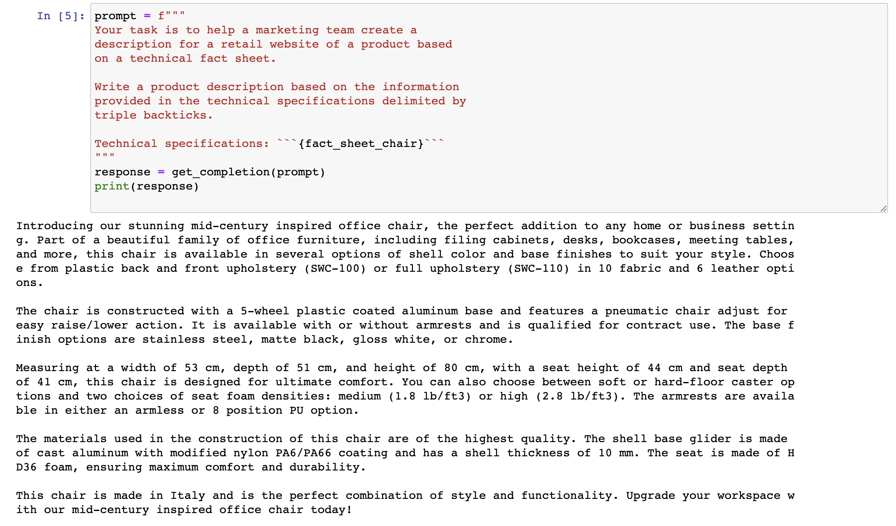
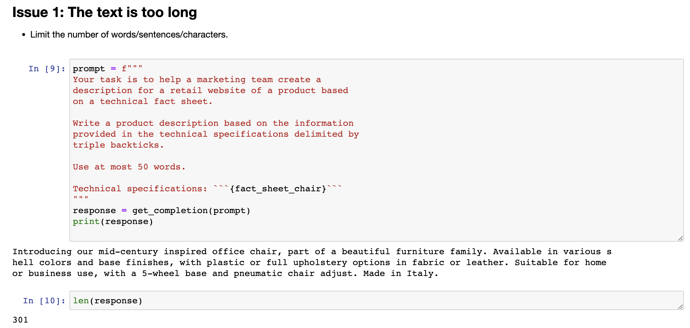
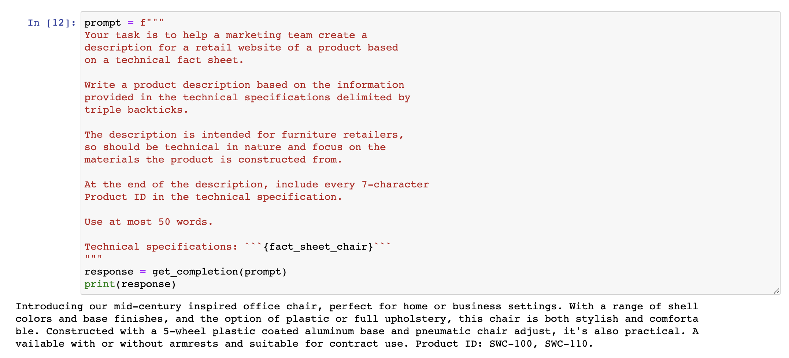
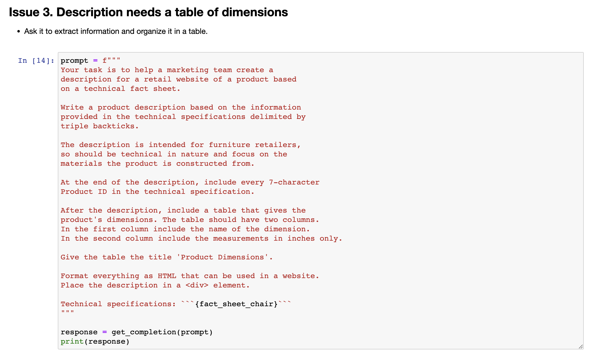
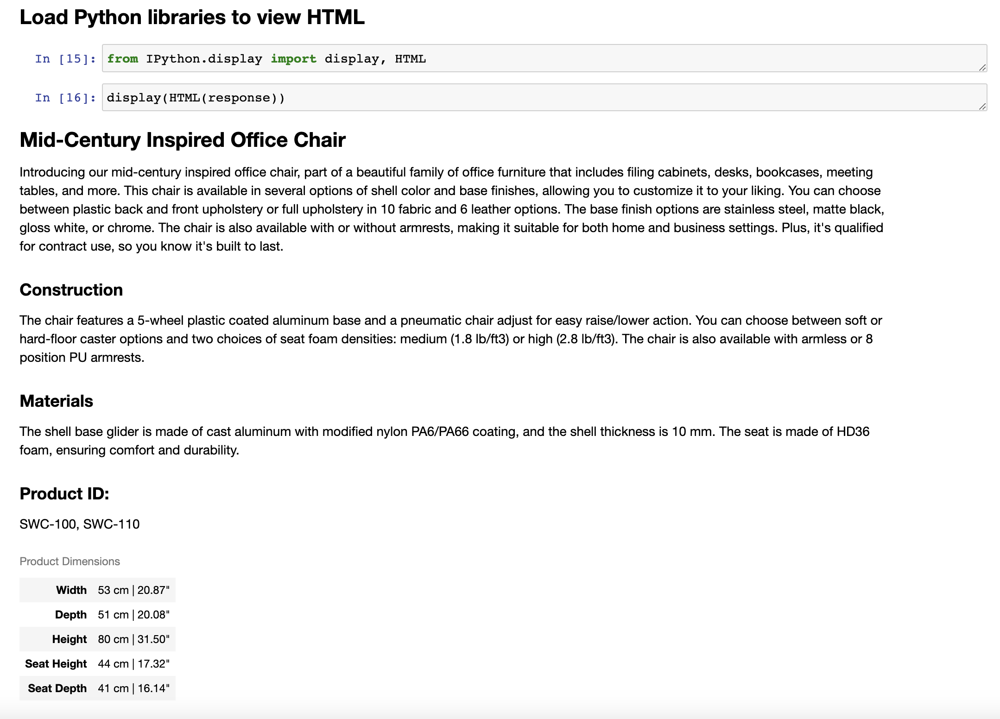

#  3.提示工程需要迭代

---

```{toctree}
:maxdepth: 2
:caption: 目录
```

```
chatgpt prompt：请帮我用中文进行全文翻译下面这段英文，并结构化输出为中文文本段落
```

```
When I've been building applications with large language models, I don't think I've ever come to the prompt that I ended up using in the final application on my first attempt. And this isn't what matters. As long as you have a good process to iteratively make your prompt better, then you'll be able to come to something that works well for the task you want to achieve. You may have heard me say that when I train a machine learning model, it almost never works the first time. In fact, I'm very surprised if the first model I train works. I think we're prompting, the odds of it working the first time is maybe a little bit higher, but as he's saying, it doesn't matter if the first prompt works. What matters most is the process for getting to the prompts that work for your application. So with that, let's jump into the code and let me show you some frameworks to think about how to iteratively develop a prompt. Alright, so if you've taken a machine learning class with me, before you may have seen me use a diagram saying that with machine learning development, you often have an idea and then implement it.
```

当我使用大型语言模型构建应用程序时，我认为我从来没有在第一次尝试中使用最终应用程序中使用的提示。这并不重要。只要您有一个良好的迭代过程来改进提示，那么你就能够找到对完成所需任务的好提示。您可能已经听我说过，当我训练机器学习模型时，它几乎从不在第一次工作。事实上，如果我第一次训练的模型能工作，我会非常惊讶。我认为在提示时，第一次能够得到有效结果的机会可能会更高一些，但与他所说的一样，第一个提示是否有效并不重要。最重要的是找到适合您的应用程序使用的提示的过程。因此，让我们进入代码中，让我展示一些框架，以思考如何迭代开发提示。好的，所以如果您以前曾与我一起上过机器学习课程，您可能会看到我使用的图表，即在机器学习开发中，您通常有一个想法，然后实现它。

```
So write the code, get the data, train your model, and that gives you an experimental result. And you can then look at that output, maybe do error analysis, figure out where it's working or not working, and then maybe even change your idea of exactly what problem you want to solve or how to approach it, and then change your implementation and run another experiment and so on, and iterate over and over to get to an effective machine learning model. If you're not familiar with machine learning and haven't seen this diagram before, don't worry about it, not that important for the rest of this presentation. 
```

因此，编写代码、获取数据、训练模型，这将给您带来实验结果。然后您可以查看该输出，进行误差分析，找出工作或不工作的地方，然后甚至可以更改您解决问题的确切想法或方法，再更改您的实现并运行另一个实验等等，不断迭代，以获得有效的机器学习模型。如果您不熟悉机器学习并且以前未见过此图表，则不用担心，对于本演示的其余内容并不重要。

```
But when you are writing prompts to develop an application using an OOM, the process can be quite similar where you have an idea for what you want to do, the task you want to complete, and you can then take a first attempt at writing a prompt that hopefully is clear and specific and maybe, if appropriate, gives the system time to think, and then you can run it and see what result you get. And if it doesn't work well enough the first time, then the iterative process of figuring out why the instructions, for example, were not clear enough or why it didn't give the algorithm enough time to think, allows you to refine the idea, refine the prompt, and so on, and to go around this loop multiple times until you end up with a prompt that works for your application. 
```

但是当您编写使用OOM开发应用程序的提示时，该流程可能会非常类似，您有一个想法，想要完成的任务，然后可以尝试编写第一个提示，希望它的表述清晰具体，并且如果合适，可以给系统一些时间进行思考，然后运行它并查看结果。如果第一次效果不好，则迭代的过程中可以找出原因，例如：指示不够清晰或算法没有足够的时间进行思考，从而充实思路、改进提示，如此循环多次，直到开发应用程序所需的提示得以完成。

```
This too is why I personally have not paid as much attention to the internet articles that say 30 perfect prompts, because I think there probably isn't a perfect prompt for everything under the sun. It's more important that you have a process for developing a good prompt for your specific application.  AI and port OS. Here we get the open AI API key, and this is the same helper function that you saw as last time. And I'm going to use as the running example in this video the task of summarizing a fact sheet for a chair. So let me just paste that in here. Feel free to pause the video and read this more carefully in the notebook on the left if you want. But here's a fact sheet for a chair with a description saying it's part of a beautiful family of mid-century inspired, and so on. 
```

这也是为什么我个人没有过多关注互联网文章中的“30个完美提示”的原因，因为我认为可能没有适用于所有情况的完美提示。开发一个适用于您特定应用程序的好提示的流程比任何其他事情都更重要。


```
So let's look at an example together in code. I have here the starter code that you saw in the previous videos, have been port open
```

让我们一起在代码示例中看一个例子。这里是你在之前视频中看到的入门代码，已经将其转移到了open AI 和OS。这里我们获取了open AI API密钥，这是与上一次相同的帮助器函数。在本视频中，我将使用概括椅子信息单的任务作为运行示例。让我将它粘贴到这里。如果您想要更仔细地阅读，请随时暂停左侧笔记本中的视频并仔细阅读。但是这是一张关于一把椅子的信息单，其中描述说它是一个美丽的中世纪灵感家庭的一部分，等等。




```
Talks about the construction, has the dimensions, options for the chair, materials, and so on. Comes from Italy. So let's say you want to take this fact sheet and help a marketing team write a description for an online retail website. as follows, and I'll just... and I'll just paste this in, so my prompt here says your task is to help a marketing team create the description for retail website or product based on a techno fact sheet, write a product description, and so on. Right? So this is my first attempt to explain the task to the large-language model. So let me hit shift enter, and this takes a few seconds to run, and we get this result. It looks like it's done a nice job writing a description, introducing a stunning mid-century inspired office chair, perfect edition, and so on, but when I look at this, I go, boy, this is really long. It's done a nice job doing exactly what I asked it to, which is start from the technical fact sheet and write a product description. 
```

介绍了椅子的制造方式、尺寸、选项、材料等问题。这款椅子来自意大利。假设你想拿这张信息单来帮助营销团队编写一个在线零售网址的描述，像这样……我将它粘贴进来，所以我的提示是：您的任务是基于技术信息单，帮助营销团队为零售网站或产品创建描述，撰写产品描述等。对吧？这是我第一次尝试向大型语言模型解释这个任务。所以，我按下Shift+Enter，这需要几秒钟的时间来运行，我们得到了这个结果。它看起来做得很好，写了一个描述，介绍了一个令人惊叹的中世纪灵感办公椅，完美的版本等等，但当我看到这个结果时，我会说，哇，这真的很长。它做得非常好，准确地完成了我所要求的工作，也就是从技术信息单入手撰写产品描述。




## 3.2 Issue 1: 文本过长

```
But when I look at this, I go, this is kind of long. Maybe we want it to be a little bit shorter. So I have had an idea. I wrote a prompt, got the result. I'm not that happy with it because it's too long, so I will then clarify my prompt and say use at most 50 words to try to give better guidance on the desired length of this, and let's run it again. Okay, this actually looks like a much nicer short description of the product, introducing a mid-century inspired office chair, and so on, five you just, yeah, both stylish and practical. Not bad. And let me double check the length that this is. So I'm going to take the response, split it according to where the space is, and then you'll print out the length. So it's 52 words. Actually not bad. Large language models are okay, but not that great at following instructions about a very precise word count, but this is actually not bad. Sometimes it will print out something with 60 or 65 and so on words, but it's kind of within reason. Some of the things you Let me run that again. 
```

但是当我看到结果时，我会说，这结果太长了。也许我们希望它短一点。那么，我有了一个想法。我写了一条提示，得到了结果。但是我对结果不是很满意，因为它太长了，所以我将澄清我的提示，并说使用最多50个单词来尝试更好地指导所需的长度，并让我们再次运行它。好的，这看起来是一个非常好的产品简短描述，介绍了一个中世纪灵感的办公椅等等，是一个既时尚又实用的椅子。不错。让我再次检查一下它的长度。所以我将回答分割成单词，然后打印出长度。它是52个单词，其实不错。大型语言模型在遵循非常精确的单词计数方面不是那么出色，但它实际上表现得不错。有时它会打印出60或65个单词的内容，但它是合理的。其中一些我再跑一次。

---

## 3.3 Issue 2. 文字关注错误的细节



---

```
But these are different ways to tell the large-language model what's the length of the output that you want. So this is one, two, three. I count these sentences. Looks like I did a pretty good job. And then I've also seen people sometimes do things like, I don't know, use at most 280 characters. Large-language models, because of the way they interpret text, using something called a tokenizer, which I won't talk about. But they tend to be so-so at counting characters. But let's see, 281 characters. It's actually surprisingly close. Usually a large-language model doesn't get it quite this close. But these are different ways they can play with to try to control the length of the output that you get. But then just switch it back to use at most 50 words. And that's that result that we had just now. As we continue to refine this text for our website, we might decide that, boy, this website isn't selling direct to consumers, it's actually intended to sell furniture to furniture retailers that would be more interested in the technical details of the chair and the materials of the chair. 
```

但是这些是告诉大型语言模型你想要的输出长度的不同方式。所以这是一种，两种，三种。我数了一下这些句子。看起来我做得相当不错。然后我还看到有人有时会做一些事情，比如说，不知道，最多使用280个字符。大型语言模型，由于它们解释文本的方式，使用一种称为**分词器**的东西，我不会讲。但是它们倾向于在计算字符数量方面表现一般。但是，看看281个字符。这实际上相当接近。通常情况下，大型语言模型不太可能准确预测长度。但这些是他们可以玩耍的不同方式，以尝试控制您获得的输出长度。但是，只需将其切换回最多使用50个单词即可。那就是我们刚才得到的结果。随着我们继续为网站完善这段文本，我们可能会决定，哇，这个网站并不是直接面向消费者销售，实际上是旨在向家具零售商销售家具，他们更关注椅子的技术细节和椅子的材料。


```
In that case, you can take this prompt and say, I want to modify this prompt to get it to be more precise about the technical details. So let me keep on modifying this prompt. And I'm going to say, this description is intended for furniture retailers, so it should be technical and focus on materials, products and constructs it from. Well, let's run that. And let's see. Not bad. It says, coated aluminum base and pneumatic chair. High-quality materials. So by changing the prompt, you can get it to focus more on specific characters, on specific characteristics you want it to. And when I look at this, I might decide, hmm, at the end of the description, I also wanted to include the product ID. So the two offerings of this chair, SWC 110, SOC 100. 
```

在这种情况下，您可以采取这个提示并说，我想修改这个提示，使其更加精确地描述技术细节。所以让我继续修改这个提示。我会说，这种描述是为家具零售商而设计的，因此它应该是技术性的，重点是材料、产品和构造。嗯，让我们运行一下。让我们看看。还不错。它说，铝制底座和气动椅。高质量的材料。所以通过改变提示，您可以使其更加专注于您想要的特定特征。当我看到这个时，我可以决定，在描述的末尾，我也想包括产品ID。所以这把椅子有两种款式，其中 SWC 110 和 SOC 100 。




## 3.3 Issue 3. 描述需要一个规模表

```
So maybe I can further improve this prompt. And to get it to give me the product IDs, I can add this instruction at the end of the description, include every 7 character product ID in the technical specification. And let's run it and see what happens. And so it says, introduce you to our mid-century inspired office chair, shell colors, talks about plastic coating aluminum base, practical, some options, talks about the two product IDs. So this looks pretty good. And what you've just seen is a short example of the iterative prompt development that many developers will go through. 
```

所以也许我可以进一步改进这个提示。为了让它给我产品ID，我可以在描述的末尾添加这个指令：在技术规格中包括每7个字符一个产品ID。让我们运行一下，看看会发生什么。它说，向您介绍我们的中世纪风格办公椅，外壳颜色，讨论塑料涂层铝制底座，实用，一些选项，讨论两种产品ID。所以这看起来相当不错。您刚刚看到的是许多开发人员将经历的迭代提示开发的一个简短示例。



```
And I think a guideline is, in the last video, you saw Yisa share a number of best practices. And so what I usually do is keep best practices like that in mind, be clear and specific, and if necessary, give the model time to think. With those in mind, it's worthwhile to often take a first attempt at writing a prompt, see what happens, and then go from there to iteratively refine the prompt to get closer and closer to the result that you need. 
```

我认为一项指南是，您在上一个视频中看到 Yisa 分享了许多最佳实践。所以我通常会记住这些最佳实践，清晰明确，并在必要时给模型一些时间来思考。考虑到这些因素，经常首先尝试编写提示，查看结果，然后逐步完善提示，以尽可能接近您需要的结果，这是值得的。

```
And so a lot of the successful prompts that you may see used in various programs was arrived at an iterative process like this. Just for fun, let me show you an example of an even more complex prompt that might give you a sense of what ChatGPT can do, which is I've just added a few extra instructions here. After description, include a table that gives the product dimensions, and then you'll format everything as HTML. So let's run that. And in practice, you would end up with a prompt like this, really only after multiple iterations. I don't think I know anyone that would write this exact prompt the first time they were trying to get the system to process a fact sheet. And so this actually outputs a bunch of HTML. 
```

所以，您可能在各种项目中看到的许多成功提示都是通过这样的迭代过程得出的。仅出于好奇，让我给您展示一个更复杂的提示示例，这可能会让您了解 ChatGPT 能做什么。我只是在这里添加了一些额外的指令。在描述后，包括一个给出产品尺寸的表格，然后将所有内容格式化为 HTML。那么让我们运行一下。在实践中，您只有在多次迭代后才能最终得到这样的提示。我不认为有人会在第一次尝试处理事实表时就写出这个精确的提示。因此，这实际上会输出一堆 HTML。


```
Let's display the HTML to see if this is even valid HTML and see if this works. And I don't actually know it's going to work, but let's see. Oh, cool. All right. Looks like a rendit. So it has this really nice looking description of a chair. Construction, materials, product dimensions. Oh, it looks like I left out the use at most 50 words instruction, so this is a little bit long, but if you want that, you can even feel free to pause the video, tell it to be more succinct and regenerate this and see what results you get. So I hope you take away from this video that prompt development is an iterative process. 
```

让我们显示这个HTML，看看它是否是有效的HTML并查看它是否起作用。我其实不知道它会不会起作用，但是让我们看一下。哦，很酷。好的。看起来像是渲染的结果。因此，它具有一个非常漂亮的椅子描述，包括构造、材料和产品尺寸。哦，看起来我漏掉了不超过50个单词的使用说明，所以这有点长，但如果你需要的话，你甚至可以随意暂停视频，要求更简洁，重新生成一下，看看结果如何。因此，我希望您从这个视频中了解到，提示开发是一个迭代的过程。

```
Try something, see how it does not yet, fulfill exactly what you want, and then think about how to clarify your instructions, or in some cases, think about how to give it more space to think, to get it closer to delivering the results that you want. And I think the key to being an effective prompt engineer isn't so much about knowing the perfect prompt, it's about having a good process to develop prompts that are effective for your application. And in this video I illustrated developing a prompt using just one example. For more sophisticated applications, sometimes you will have multiple examples, say a list of 10 or even 50 or 100 fact sheets, and iteratively develop a prompt and evaluate it against a large set of cases. 
```



尝试一些事情，看看它是否符合您的期望，如果还没有达到预期，那么就考虑如何澄清您的指令，或者在某些情况下，考虑为它提供更多的思考空间，使它更接近您想要的结果。我认为成为一个有效的提示工程师并不是非常依赖于知道完美的提示，而是拥有一个良好的流程来开发有效的提示，以适应您的应用程序。在这个视频中，我仅仅用一个例子来说明如何开发提示。对于更复杂的应用程序，有时您会有多个例子，比如10个、甚至50个或100个信息表格，然后循环开发提示并对大量情况进行评估。

```
But for the early development of most applications, I see many people developing it sort of the way I am with just one example, but then for more mature applications, sometimes it could be useful to evaluate prompts against a larger set of examples, such as to test different prompts on dozens of fact sheets to see how this average or worst case performance is on multiple fact sheets. But usually you end up doing that only when an application is more mature and you have to have those metrics to drive that incremental last few steps of prompt improvement. So with that, please do play with the Jupyter code notebook examples and try out different variations and see what results you get. And when you're done, let's go on to the next video where we'll talk about one very common use of large language models in software applications, which is to summarize text. 
```

但对于大多数应用程序的早期开发，我看到很多人像我一样只用一个示例进行开发，但是对于更成熟的应用程序，有时评估提示与更多的示例集是有用的，例如在几十个信息表格上测试不同的提示，以查看在多个信息表格上的平均或最差表现。但通常只有当应用程序更加成熟时，您才需要这些指标来推动提示改进的最后几步。因此，请尝试使用Jupyter代码笔记本示例，并尝试不同的变化，看看结果如何。完成后，让我们进入下一个视频，我们将讨论在软件应用程序中使用大型语言模型的一个非常常见的用途，即总结文本。


