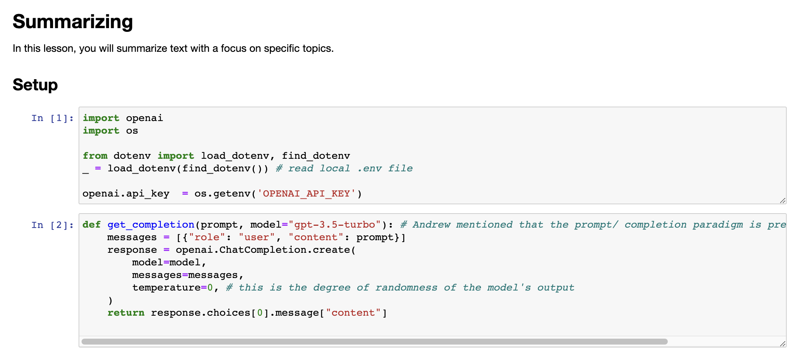
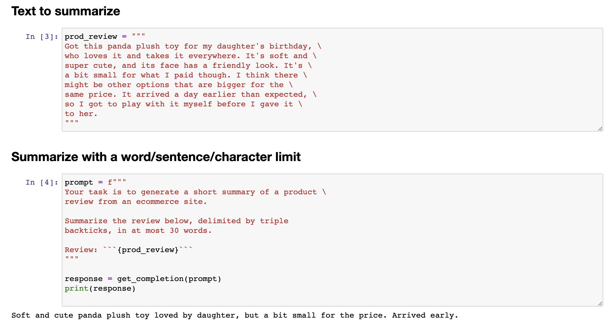
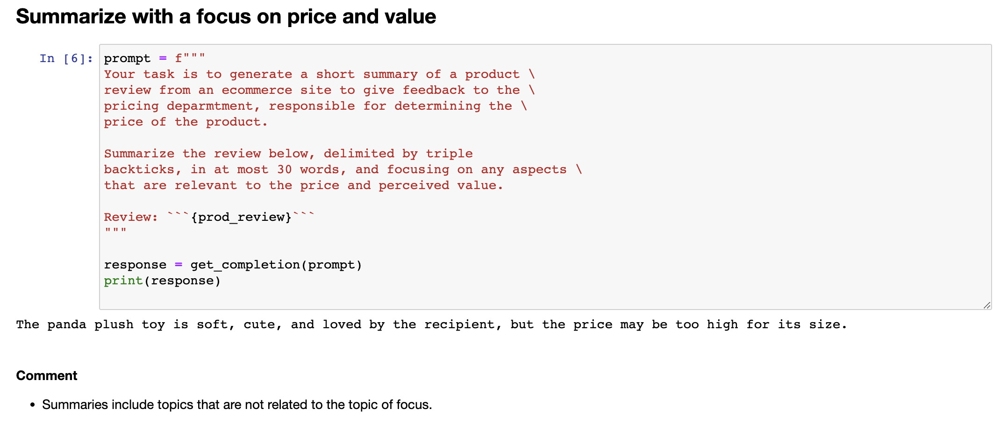

#  4.总结类应用

---

```{toctree}
:maxdepth: 2
:caption: 目录
```

```
chatgpt prompt：请帮我用中文进行全文翻译下面这段英文，并结构化输出为中文文本段落
```

```
There's so much text in today's world, pretty much none of us have enough time to read all the things we wish we had time to. So one of the most exciting applications I've seen of large language models is to use it to summarise text. And this is something that I'm seeing multiple teams build into multiple software applications. 
```

在当今的世界中，有如此多的文本存在，几乎没有人有足够的时间阅读我们希望有时间阅读的所有文本。因此，我看到大型语言模型最令人兴奋的应用之一是使用它来概括文本。这是我看到多个团队正在将其内置到多个软件应用程序中的事情。

```
You can do this in the Chat GPT Web Interface. I do this all the time to summarise articles so I can just kind of read the content of many more articles than I previously could. And if you want to do this more programmatically, you'll see how to in this lesson. So with that, let's dig into the code to see how you could use this yourself to summarise text. So let's start off with the same starter code as you saw before of importOpenAI, load the API key and here's that getCompletion helper function. 
```

你可以在Chat GPT网络界面中完成这项工作。我经常会这样做来总结文章，这样我就可以阅读更多文章的内容，而不仅仅是以前能读的那么少。如果你想以更加机械化的方式实现这一点，你可以在这节课中看到如何做到这一点。所以，让我们深入了解代码，看看你如何使用它来总结文本。因此，让我们从与之前相同的入门代码开始，导入OpenAI，加载API密钥，以及这个getCompletion助手函数。



```
I'm going to use as the running example, the task of summarising this product review. Got this panda plush toy from a daughter's birthday who loves it and takes it everywhere and so on and so on. If you're building an e-commerce website and there's just a large volume of reviews, having a tool to summarise the lengthy reviews could give you a way to very quickly glance over more reviews to get a better sense of what all your customers are thinking. So here's a prompt for generating a summary. Your task is to generate a short summary of a product review from e-commerce websites, summarise the review below and so on in at most 30 words. 
```

我将使用一个运行示例，即对该产品评论进行摘要的任务。我得到了这个熊猫毛绒玩具作为女儿生日礼物，她非常喜欢并且带它到处走等等。如果你正在构建一个电子商务网站并且有大量的评论，那么一个可以总结冗长评论的工具可以让你很快地浏览更多的评论，以更好地了解所有客户的想法。因此，这是一个产生摘要的提示。你的任务是从电子商务网站的产品评论中生成一个简短的摘要，并在30个单词以内对评论进行总结等等。

## 4.1 文字总结



## 4.2 针对某种信息总结




## 4.3 尝试“提取”而不是“总结”


## 4.4 针对多项信息总结


